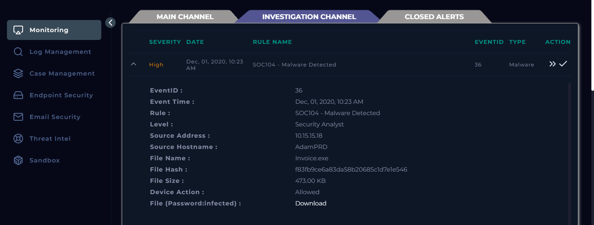
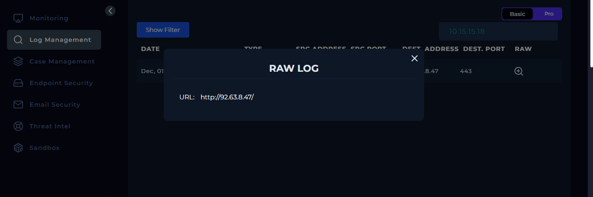
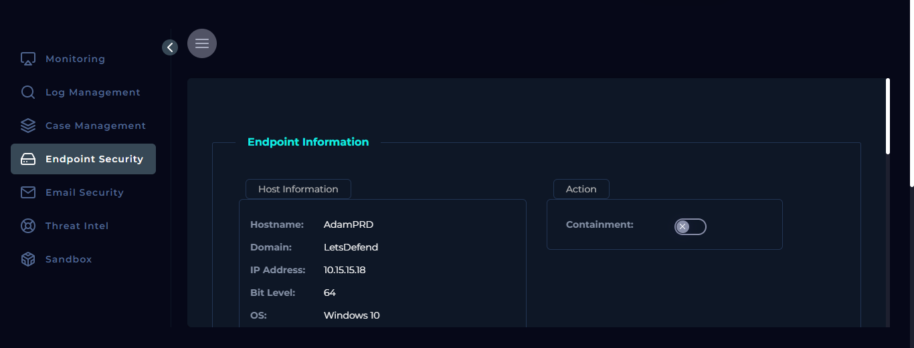
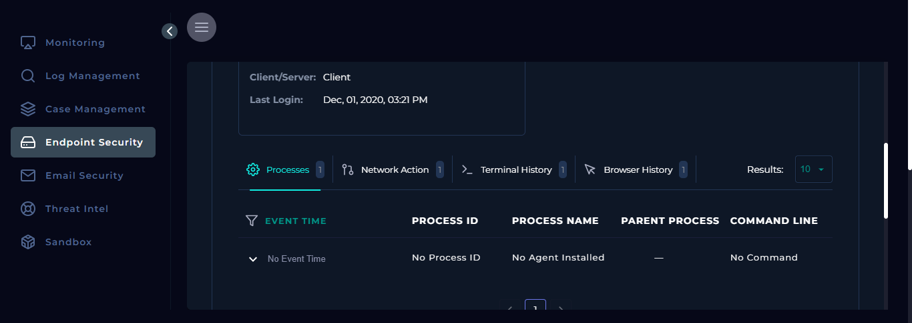
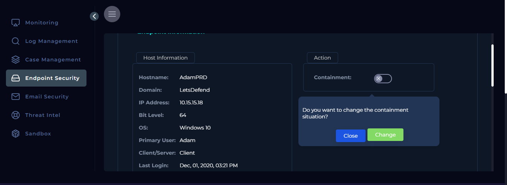
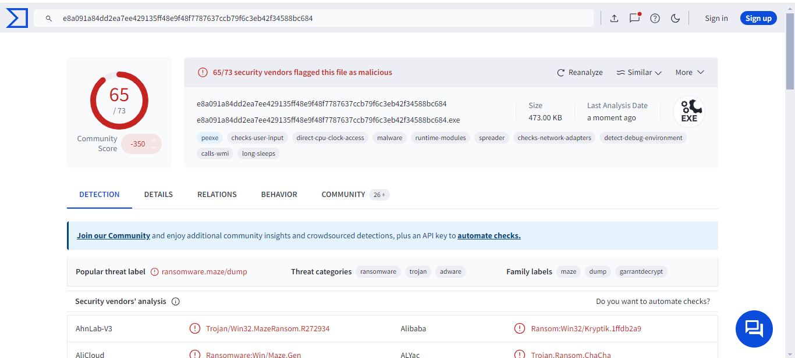
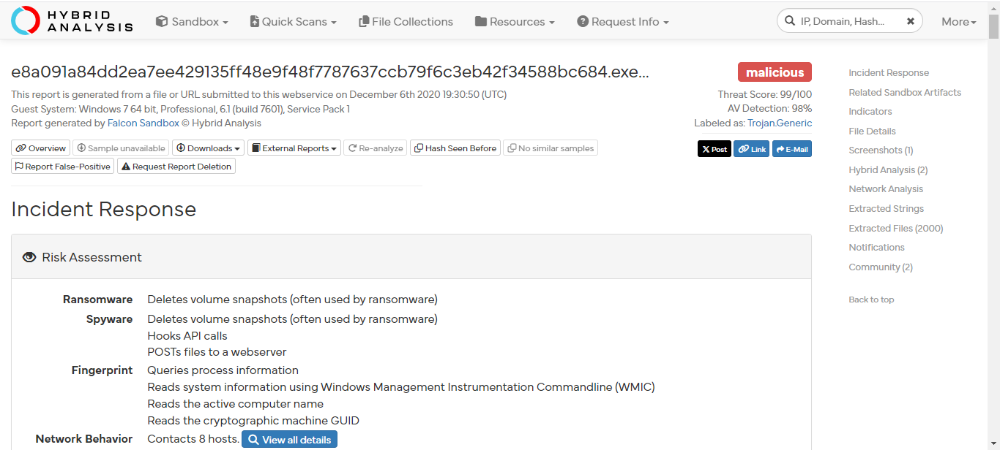
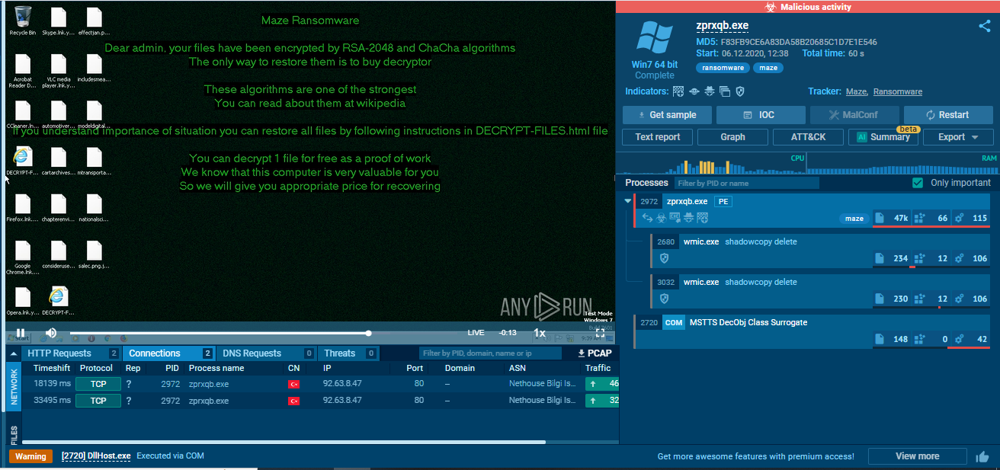

# SOC104 - Malware Detection and Mitigation
## LETSDEFEND.IO SIEM

# Maze Ransomware Detection and Analysis

This write-up documents the detection, analysis, and response to a Maze ransomware infection discovered on the LETSDEFEND platform SIEM. The incident was captured through EventID 36 and showcases the investigative process, analysis of malware behavior, and final mitigation steps.

---

## Incident Summary

**Event ID:** 36  
**Event Time:** Dec 01, 2020, 10:23 AM  
**Rule Triggered:** SOC104 - Malware Detected  
**Source Address:** 10.15.15.18  
**Source Hostname:** AdamPRD  
**Malicious File:** Invoice.exe  
**MD5 Hash:** f83fb9ce6a83da58b20685c1d7e1e546  
**File Size:** 473.00 KB  
**Device Action:** Allowed  
**Status:** True Positive - Maze Ransomware Detected

### Initial Event Detection

The malware was detected on the host `AdamPRD` (IP: 10.15.15.18) by the LETSDEFEND SIEM. The alert was triggered by a malicious executable file, `Invoice.exe`, flagged under the SOC104 rule for malware detection. No initial actions were taken as the device action for the malware was `Allowed`.

---

## Log Management Findings

From the raw log data, we observed that the host `AdamPRD` accessed a suspicious URL leading to a Command and Control (C2) server at `http://92.63.8.47/`. This IP address is known for hosting Maze ransomware infrastructure.

---

## Endpoint Security Investigation

### Host Information
- **Hostname:** AdamPRD  
- **OS:** Windows 10 (64-bit)  
- **IP Address:** 10.15.15.18  
- **Last Login:** Dec 01, 2020, 03:21 PM  
- **Client/Server Role:** Client

From the Endpoint Security dashboard, we gathered the following findings:
- No agents were installed on the machine, limiting the ability to quarantine the ransomware automatically.
- Review of the **process history**, **network connections**, **CMD history**, and **browser history** revealed no unusual activity directly related to the Maze ransomware before detection.

Given the infection risk, a manual request for quarantine was made to isolate the host and prevent further damage.

---

## Malware Analysis

### VirusTotal Analysis
The file hash `f83fb9ce6a83da58b20685c1d7e1e546` was submitted to VirusTotal for analysis, where it was flagged as Maze ransomware. Multiple AV engines confirmed it as a malicious file.

### Hybrid Analysis
Upon submission to Hybrid Analysis, the ransomware behavior was confirmed once again, with an attempt to communicate with the C2 server at `92.63.8.47`.

### Any.Run Sandbox Analysis
An additional dynamic analysis was performed using the Any.run sandbox, which confirmed the file’s behavior as Maze ransomware. It showed the file attempting to reach out to `92.63.8.47`, a known Maze ransomware Command and Control (C2) server.

---

## Artifacts

The following artifacts were identified during the analysis:

1. **MD5 Hash:**
   - **Value:** `f83fb9ce6a83da58b20685c1d7e1e546`
   - **Type:** MD5 Hash
   - **Comment:** Identified as Maze ransomware during analysis.

2. **IP Address:**
   - **Value:** `92.63.8.47`
   - **Type:** C2 Server IP Address
   - **Comment:** This IP address is associated with Maze ransomware's Command and Control infrastructure.

3. **URL Address:**
   - **Value:** `http://92.63.8.47/`
   - **Type:** URL Address
   - **Comment:** The URL leads directly to the C2 server where the ransomware attempted to establish communication.

---

## Conclusion and Mitigation

The incident was confirmed as a **true positive** involving Maze ransomware. The malicious file `Invoice.exe` was allowed to run on the host `AdamPRD`, which then attempted to communicate with a Command and Control server. Although no agents were installed on the system, containment measures were initiated to quarantine the host.

Further actions recommended:
- Full inspection of systems within the same local network segment.
- Deploy endpoint protection agents to enhance real-time detection and response.

---

**Acknowledgment:**

This investigation was conducted using the LETSDEFEND platform, leveraging SIEM log analysis and sandbox malware investigation tools.
